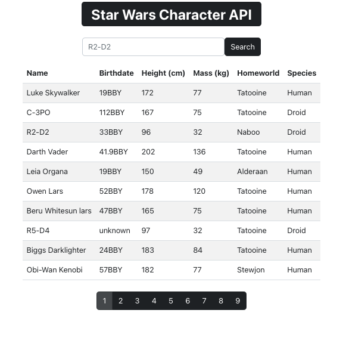

# Star Wars Character Database

 
An application to display and search for characters found in the Star Wars universe.
 

[Click here to to use!](https://star-wars-api-natmsal33.herokuapp.com/)

 

## Summary

This app uses Axios through React and Javascript to retrieve character data from the [swapi.dev](swapi.dev) API and uses React-Bootstrap to for style.

The app shows a loading screen until all axios promises have been resolved, and then displays each character and their corresponding data in a table in sets of 10. There is a page bar below the table that will take the user to the rest of the results in sets of 10. There's a search bar above the table that allows users to search for any star wars characters by name, and once the user presses submit, only the corresponding characters will be displayed in the table below. If the user inputs a string that has no match in the swapi.dev character API, the page displays "no results".

 

Author

- **Natalie Salazar** - Software Developer
